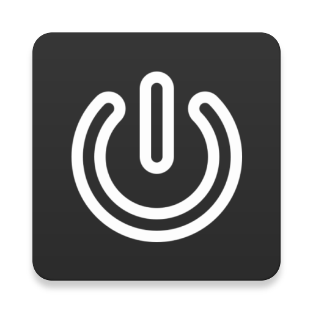
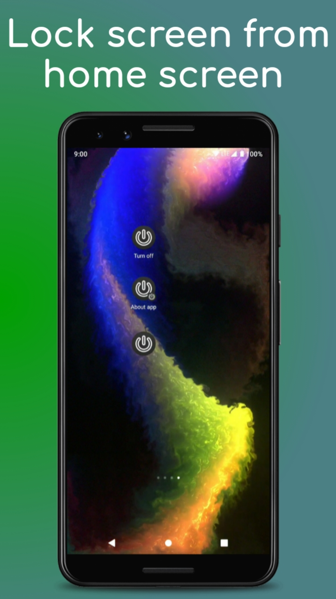
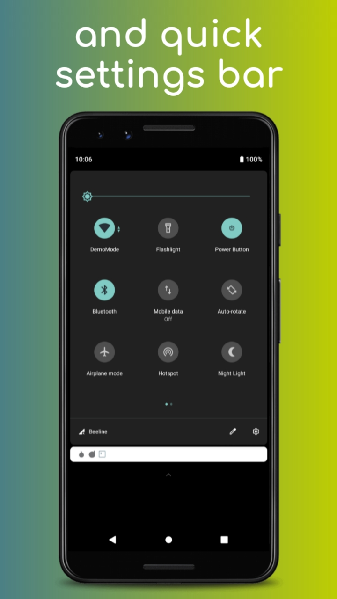
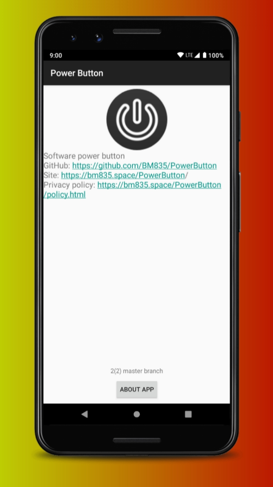

# PowerButton
Turn off device screen without clicking the hardware button

Icon made by [Recep Kutuk](https://www.flaticon.com/authors/recep-kutuk) from www.flaticon.com

## Screenshots

## Donate
[Liberapay](https://liberapay.com/BM835/)
[Patreon](https://patreon.com/Bm835)
[Other](https://bm835.space/PowerButton/funding.html)
